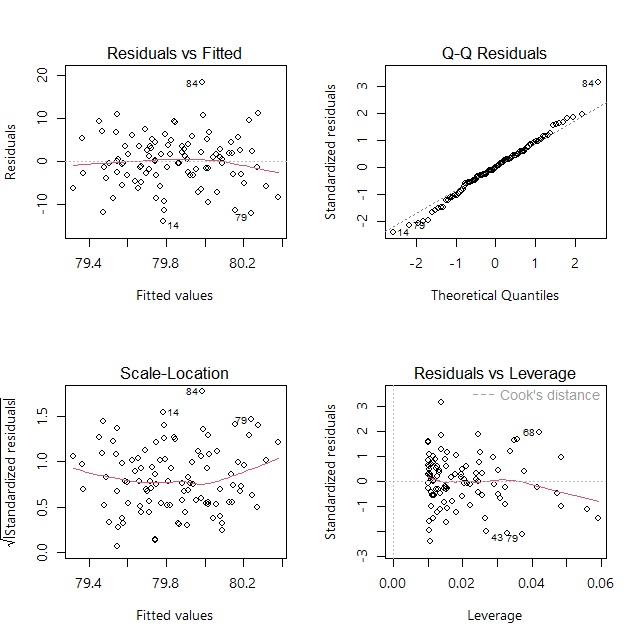

This document contains instructions and code to generate *ggplot2* graphs that follow Ambition's brand and identity guidelines. To examplify the instructions, simulated data is used.

```{r setup, include=FALSE}
knitr::opts_chunk$set(echo = TRUE)

# simulate data
set.seed(20052024) # date of meeting

n = 100

# simulate data
dat <- faux::rnorm_multi(n = n, 
                         mu = c(6, 6, 7, 10),
                         sd = c(1, 1, 1, 1),
                         r = c(0, 0, 0, 0, .7, 0), 
                         varnames = c("T1_g1", "T1_g2", "T2_g1", "T2_g2"),
                         empirical = FALSE)

# format data: wide data
df <- data.frame(id = 1:n,
                 Group = c(rep("Control group", n), rep("Experimental group", n)),
                 T1 = c(dat$T1_g1, dat$T1_g2),
                 T2 = c(dat$T2_g1, dat$T2_g2))
# format data: long data
df_long <- reshape2::melt(df, id.vars = c("id", "Group"), variable.name = "timepoint")


```


## Ambition's colour palette  

Below, the Hex codes for the Ambition colours are included.

```{r, fig.align='center'}
navy    = "#474C68"
cyan    = "#14B4E9"
coral   = "#E94B58"
teal    = "#00987C"
purple  = "#6D2160"
orange  = "#EC642D"
yellow  = "#FFCC00"
blue    = "#006FB7"
red     = "#BF1C1D"
white   = "#FFFFFF"
black   = "#000000"
```

Ambition's core palette is led by navy and supported by black and white.  

Where applicable, tints (40%, 30%, 20% or 10%) of navy or black can be used. Such tints can be created using the function below:    

```{r, fig.align='center'}
# source: https://rdrr.io/cran/MESS/src/R/colorfunctions.R
col.tint <- function(col, tint=.4) {
  
  if(missing(col))
    stop("a vector of colours is missing")
  
  if (tint<0 | tint>1)
    stop("shade must be between 0 and 1")
  
  mat <- t(col2rgb(col, alpha=TRUE)  +  c(rep(1-tint, 3), 0)*(255-col2rgb(col, alpha=TRUE)))
  rgb(mat, alpha=mat[,4], maxColorValue=255)
}

```

```{r, fig.align='center'}
# usage example
col.tint(black, tint = .2)
```

Here is code to generate all applicable tints:  
```{r, fig.align='center'}
# navy
navy40 <- col.tint(navy, tint = .4)
navy30 <- col.tint(navy, tint = .3)
navy20 <- col.tint(navy, tint = .2)
navy10 <- col.tint(navy, tint = .1)
palette_navy <- c(navy, navy40, navy30, navy20, navy10)

# black
black40 <- col.tint(black, tint = .4)
black30 <- col.tint(black, tint = .3)
black20 <- col.tint(black, tint = .2)
black10 <- col.tint(black, tint = .1)
palette_black <- c(black, black40, black30, black20, black10)
```

In addition to the core palette, there is a bright palette consisting of five bright (cyan, coral, teal, purple & orange) and three accent (yellow, blue & red) colours.  


```{r, echo=F, fig.align='center'}
palette_lead <- c(cyan, coral, teal, purple, orange)
palette_accent <- c(yellow, blue, red) 
scales::show_col(c(palette_navy, palette_black,
                   palette_lead, 
                   palette_accent), 
                 ncol = length(palette_lead),
                 cex_label = .8)
```

## Ambition's ggplot theme  


When data is visualised using R, the following ggplot theme should be used so that our plots look consistent across outputs and teams.  

We use ggplot's *theme_bw()*. To comply with brand and accessibility guidelines, the all font sizes comply with the minimum requirement (i.e., 12pt). The font size for headings is set to be 14pt. **Segoe UI** is used as typeface throughout.    

The background colour of facet labels is set to be a 20% tint of black.  

```{r, fig.align='center'}
# load libraries
library(ggplot2)
library(extrafont)
# if not run before, run
# font_import()

# define font sizes for normal text and headings in pt
font_size = 12
head_size = font_size + 2

# define theme for plot
ambition_theme <- theme_bw(base_family = "Segoe UI") + 
  theme(
    # font size and face settings
    text = element_text(family = "Segoe UI", size = font_size),
    title = element_text(face = "bold", size = font_size),
    plot.title = element_text(size = head_size, face = "bold"),
    plot.subtitle = element_text(size = font_size, face = "plain"),
    axis.title = element_text(size = font_size, face = "bold"),
    axis.text = element_text(size = font_size),
    legend.title = element_text(size = font_size, face = "bold"),
    legend.text = element_text(size = font_size),
    strip.text = element_text(size = font_size),
    plot.caption = element_text(size = font_size, face = "plain", hjust = 0), # any figure notes positioned left-bound
    # correct tint of grey for panels
    strip.background = element_rect(fill = black20),
    # legend positioned at bottom
    legend.position = "bottom"
  )

```


To call the theme, simply add *+ ambition_theme* to your ggplot command.  

```{r, message=F, fig.align='center'}
# simulate data
dat <- data.frame(Value = rnorm(n = 1000),
                  Group = c("A", "B"))
# create plot
ggplot(data =  dat, aes(x = Value)) + 
  geom_histogram() + 
  ambition_theme +
  labs(title = "A basic histogram", subtitle = "(simulated data)", caption = "This is a note.") +
  ylab("Count")
```


While the theme sets the legend to be positioned at the bottom, this is not mandatory and may not be the best choice for all plots. This can be manually overwritten for specific plots.  
  
For instance, in the plot below, a legend is redundant and can manually be removed by adding another + theme() command after calling + ambition_theme.

```{r, fig.align='center'}
# grouped scatterplot: legend redundant 
ggplot(data = df, aes(x = T1, y = T2, shape = Group)) +
  geom_point()+
  facet_wrap(. ~ Group, nrow = 2) + 
  ambition_theme + 
  xlab("Baseline assessment") + ylab("Outcome assessment") 

# grouped scatterplot: redundant legend removed 
ggplot(data = df, aes(x = T1, y = T2, shape = Group)) +
  geom_point()+
  facet_wrap(. ~ Group, nrow = 2) + 
  ambition_theme + 
  theme(legend.position = "none") +
  xlab("Baseline assessment") + ylab("Outcome assessment") 

```

> Any subsequent call of *+ theme()* overrides previous arguments passed through *+ theme()*.

## Annotations in plots  
  
The *ambition_theme* sets the font size of any title, axis and legend text. However, these settings do not apply to any annotations that are added to the text (e.g., using the *ggpubr* package).  
  
```{r, fig.align='center'}
# grouped scatterplot: redundant legend removed 
ggplot(data = df, aes(x = T1, y = T2, shape = Group)) +
  geom_point()+
  facet_wrap(. ~ Group, nrow = 2) + 
  ambition_theme + 
  theme(legend.position = "none") +
  xlab("Baseline assessment") + ylab("Outcome assessment") +
  ggpubr::stat_cor(method = "pearson", cor.coef.name = "r",
                   p.accuracy = .001, r.accuracy = .01)

```

The font size of the annotation has to be changed separately using the size argument. However, simply setting *size = font_size* will not lead to the desired result as geom_text (called in the background by *ggpubr::stat_cor()* to annotate the figure) interprets size as mm rather than as pt.

```{r, fig.align='center'}
# grouped scatterplot: redundant legend removed 
ggplot(data = df, aes(x = T1, y = T2, shape = Group)) +
  geom_point()+
  facet_wrap(. ~ Group, nrow = 2) + 
  ambition_theme + 
  theme(legend.position = "none") +
  xlab("Baseline assessment") + ylab("Outcome assessment") +
  ggpubr::stat_cor(method = "pearson", cor.coef.name = "r",
                   p.accuracy = .001, r.accuracy = .01,
                   size = font_size, family = "Segoe UI")

```

Hence, we need to convert the desired font size in pt to mm using the following function:  
  
```{r, fig.align='center'}
# source: https://github.com/zmorrissey/commonR/blob/master/R/pt_to_mm.R

#' Convert from pt to mm for ggplot2
#'
#' ggplot2 uses mm by default for line units, this function takes the desired
#' thickness in pt and converts to mm.
#'
#'
#' @keywords ggplot2 unit pt mm
#' @export pt_to_mm
#' @examples
#' ggplot(mtcars, aes(wt, mpg)) + geom_line(size=pt_to_mm(0.75))

pt_to_mm <- function(x_pt) {
    ## Convert x from pt to mm (for, e.g., ggplot2 linewidths).
    return(x_pt / ggplot2::.pt)
}

```

This then correctly changes the font size in the annotation to 12pt.  

```{r, fig.align='center'}
# grouped scatterplot: redundant legend removed 
ggplot(data = df, aes(x = T1, y = T2, shape = Group)) +
  geom_point()+
  facet_wrap(. ~ Group, nrow = 2) + 
  ambition_theme + 
  theme(legend.position = "none") +
  xlab("Baseline assessment") + ylab("Outcome assessment") +
  ggpubr::stat_cor(method = "pearson", cor.coef.name = "r",
                   p.accuracy = .001, r.accuracy = .01,
                   size = pt_to_mm(font_size), family = "Segoe UI")

```


## Colours in plots  

In situations where we want to highlight our data using colour, the bright palette should be used.  

The *ambition_theme* does not specify any colours by default. This instead needs to be specified manually using the *fill* and *col* arguments and/or *+ scale_fill_manual()* and *+ scale_color_manual()* functions.  

```{r, fig.align='center', message=FALSE}
# histogram
ggplot(data =  dat, aes(x = Value)) + 
  geom_histogram(fill = coral) + 
  ambition_theme +
  labs(title = "A basic histogram", subtitle = "(simulated data)", caption = "This is a note.") +
  ylab("Count")

# grouped scatterplot
ggplot(data = df, aes(x = T1, y = T2, col = Group)) +
  geom_point(shape = 20)+
  scale_color_manual(values = c(navy, orange)) +
  facet_wrap(. ~ Group, nrow = 2) + 
  ambition_theme + 
  theme(legend.position = "none") +
  xlab("Baseline assessment") + ylab("Outcome assessment")

```


However, please note that we avoid using cyan or yellow on a white background due to accessibility issues given the lack of contrast to the white background. There is no strict guidance which colours should be preferred. However, there is guidance in terms of the font size of colours that can be used on a white background which may apply to annotations that are included to graphs.  

All *ggplot2* graphs are created on a white background. As such, the following rules from the brand guidance apply:    

* navy - all text sizes (including annotations)  
* purple - all text sizes (including annotations)  
* red - all text sizes (including annotations)  
* blue - all text sizes (including annotations)  
* coral - heading text size only (18pt and larger)  
* teal - heading text size only (18pt and larger)  
* orange - heading text size only (18pt and larger)  

This may make certain colours more useful than others.  

For instance, this is allowed because the annotations were added in blue and red, respectively. These colours can be used on white background in all font sizes.    


```{r, echo = F, fig.align='center'}
# grouped scatterplot 
plt_grp <- ggplot(data = df, aes(x = T1, y = T2, col = Group)) +
  geom_point(shape = 20)+
  facet_wrap(. ~ Group, nrow = 2) + 
  stat_smooth(formula = y ~ x, method = "lm", fullrange = T, se = T, alpha=0.1, fill = "black") +
  scale_color_manual(values = c(blue, red)) +
  ambition_theme + 
  theme(legend.position = "none") +
  xlab("Baseline assessment") + ylab("Outcome assessment") +
  ggpubr::stat_cor(method = "pearson", cor.coef.name = "r",
                   p.accuracy = .001, r.accuracy = .01,
                   size = pt_to_mm(font_size), family = "Segoe UI")
plt_grp

```

But this is **not** allowed as the annotations are added in teal and coral. These colours can only used on white background in heading font sizes (18pt and above).    

```{r, echo = F, fig.align='center'}
# grouped scatterplot 
plt_grp <- ggplot(data = df, aes(x = T1, y = T2, col = Group)) +
  geom_point(shape = 20)+
  facet_wrap(. ~ Group, nrow = 2) + 
  stat_smooth(formula = y ~ x, method = "lm", fullrange = T, se = T, alpha=0.1, fill = "black") +
  scale_color_manual(values = c(teal, coral)) +
  ambition_theme + 
  theme(legend.position = "none") +
  xlab("Baseline assessment") + ylab("Outcome assessment") +
  ggpubr::stat_cor(method = "pearson", cor.coef.name = "r",
                   p.accuracy = .001, r.accuracy = .01,
                   size = pt_to_mm(font_size), family = "Segoe UI")
plt_grp

```

However, both these options are allowed as the annotations are added in black (allowed in all font sizes on white background).   


```{r, echo = F, fig.align='center'}
# grouped scatterplot 
plt_grp <- ggplot(data = df, aes(x = T1, y = T2, col = Group)) +
  geom_point(shape = 20)+
  facet_wrap(. ~ Group, nrow = 2) + 
  stat_smooth(formula = y ~ x, method = "lm", fullrange = T, se = T, alpha=0.1, fill = "black") +
  scale_color_manual(values = c(blue, red)) +
  ambition_theme + 
  theme(legend.position = "none") +
  xlab("Baseline assessment") + ylab("Outcome assessment") +
  ggpubr::stat_cor(method = "pearson", cor.coef.name = "r",
                   p.accuracy = .001, r.accuracy = .01, col = "black",
                   size = pt_to_mm(font_size), family = "Segoe UI")
plt_grp

# grouped scatterplot 
plt_grp <- ggplot(data = df, aes(x = T1, y = T2, col = Group)) +
  geom_point(shape = 20)+
  facet_wrap(. ~ Group, nrow = 2) + 
  stat_smooth(formula = y ~ x, method = "lm", fullrange = T, se = T, alpha=0.1, fill = "black") +
  scale_color_manual(values = c(teal, coral)) +
  ambition_theme + 
  theme(legend.position = "none") +
  xlab("Baseline assessment") + ylab("Outcome assessment") +
  ggpubr::stat_cor(method = "pearson", cor.coef.name = "r",
                   p.accuracy = .001, r.accuracy = .01, col = "black",
                   size = pt_to_mm(font_size), family = "Segoe UI")
plt_grp

```


Similar logic applies to error bars.  

This is allowed as the colours can be used in all font sizes.  

```{r, echo = F, message = F, fig.align='center'}
# download helper functions
devtools::source_url("https://github.com/stefaniemeliss/MAGMOT/blob/master/functions/errorbars.R?raw=TRUE")

# create output data
out <- summarySEwithin(data = df_long,
                       measurevar = "value",
                       betweenvars = "Group",
                       withinvars = "timepoint")

# create plot
plt <- ggplot(data = out, aes(x = timepoint, y = value, col = Group, group = Group, shape = Group, linetype = Group)) +
  geom_errorbar(aes(ymin = value - ci, ymax = value + ci), width = .05, position = position_dodge(.2), linetype = "solid") +
  geom_point(position = position_dodge(.2), size = 2) +
  geom_line(position = position_dodge(.2)) +
  scale_color_manual(values = c(blue, red)) +
  scale_shape_manual(values = c(16, 18)) +
  xlab("Timepoint") + ylab("Outcome assessment") +
  ambition_theme +
  theme(plot.caption = element_text(hjust=0))
plt

```

However, this is not allowed as orange can only be used for headings.  


```{r, echo = F, message = F, fig.align='center'}
# create plot
plt <- ggplot(data = out, aes(x = timepoint, y = value, col = Group, group = Group, shape = Group, linetype = Group)) +
  geom_errorbar(aes(ymin = value - ci, ymax = value + ci), width = .05, position = position_dodge(.2), linetype = "solid") +
  geom_point(position = position_dodge(.2), size = 2) +
  geom_line(position = position_dodge(.2)) +
  scale_color_manual(values = c(orange, purple)) +
  scale_shape_manual(values = c(16, 18)) +
  xlab("Timepoint") + ylab("Outcome assessment") +
  ambition_theme +
  theme(plot.caption = element_text(hjust=0))
plt

```

Howver, the problem can be circumvented if the error bars are plotted in black.  


```{r, echo = F, message = F, fig.align='center'}
# create plot
plt <- ggplot(data = out, aes(x = timepoint, y = value, col = Group, group = Group, shape = Group, linetype = Group)) +
  geom_errorbar(aes(ymin = value - ci, ymax = value + ci), width = .05, position = position_dodge(.2), linetype = "solid", col = black) +
  geom_point(position = position_dodge(.2), size = 2) +
  geom_line(position = position_dodge(.2)) +
  scale_color_manual(values = c(blue, red)) +
  scale_shape_manual(values = c(16, 18)) +
  xlab("Timepoint") + ylab("Outcome assessment") +
  ambition_theme +
  theme(plot.caption = element_text(hjust=0))
plt

# create plot
plt <- ggplot(data = out, aes(x = timepoint, y = value, col = Group, group = Group, shape = Group, linetype = Group)) +
  geom_errorbar(aes(ymin = value - ci, ymax = value + ci), width = .05, position = position_dodge(.2), linetype = "solid", col = black) +
  geom_point(position = position_dodge(.2), size = 2) +
  geom_line(position = position_dodge(.2)) +
  scale_color_manual(values = c(orange, purple)) +
  scale_shape_manual(values = c(16, 18)) +
  xlab("Timepoint") + ylab("Outcome assessment") +
  ambition_theme +
  theme(plot.caption = element_text(hjust=0))
plt

```

#### Plotting data in situations where there are many groups  

There may be situations in which we have to visualise data from multiple groups/cohorts/programmes/etc. at the same time. If there are **six or less**, use all colours from the bright palette **other than cyan and yellow**. 


```{r, echo = F, fig.align='center'}

palette_plot <- c(red, blue, coral, purple, teal, orange, cyan, yellow)

n = 6
dat <- data.frame(Group = LETTERS[1:n],
                  Rating = runif(n, min = 1, max = 7))


ggplot(data = dat, aes(x = Group, y = Rating, fill = Group)) +
  geom_bar(stat = "identity", width = 0.5) + 
  #geom_errorbar(aes(ymin=mean-se, ymax=mean+se), width=.1) +
  ambition_theme + 
  coord_cartesian(ylim = c(1, 7)) +
  scale_fill_manual(values = palette_plot) + theme(legend.position = "none")

```


Please only use these yellow and cyan in cases where it is absolutely necessary due to large number of groups, i.e., **more than six**.    


```{r, echo = F, fig.align='center'}
n = 8
dat <- data.frame(Group = LETTERS[1:n],
                  Rating = runif(n, min = 1, max = 7))


ggplot(data = dat, aes(x = Group, y = Rating, fill = Group)) +
  geom_bar(stat = "identity", width = 0.5) + 
  #geom_errorbar(aes(ymin=mean-se, ymax=mean+se), width=.1) +
  ambition_theme + 
  coord_cartesian(ylim = c(1, 7)) +
  scale_fill_manual(values = palette_plot) + theme(legend.position = "none")
```

If a large number of groups requires the use of cyan and/or yellow, consider adding black borders to increase the contrast.  

```{r, echo=FALSE, fig.align='center'}
# create plot
ggplot(data = dat, aes(x = Group, y = Rating, fill = Group)) +
  geom_bar(stat = "identity", width = 0.5, col = black) + 
  #geom_errorbar(aes(ymin=mean-se, ymax=mean+se), width=.1) +
  ambition_theme + 
  coord_cartesian(ylim = c(1, 7)) +
  scale_fill_manual(values = palette_plot) + theme(legend.position = "none")
```


> Check [this resource](https://ggplot2.tidyverse.org/reference/aes_colour_fill_alpha.html) to understand the difference in the aesthetics parameters change the colour (colour and fill).  


## Other things to note  

* Sentence case has to be applied throughout, e.g., in figure or legend titles.  

* In the research team, we usually do not add titles or notes into the ggplot graph itself but instead include them in the word document (in alignment with APA 7).  

* Whenever possible, add annotations and error bars in black.  

* Error bars should represent 95% confidence intervals in research publications.  


## Special case: model diagnostic plots  

To generate model diagnostic plots for linear models in base R, please use this code. The code generates the graph and saves it in the current directory in appropriate size to be copied and pasted into the supplementary materials.  

```{r, echo = F}
# simulate data
dat <- data.frame(height = rnorm(n = 100, mean = 170, sd = 9),
                  weight = rnorm(n = 100, mean = 80, sd = 5)
)

m1 <- lm(dat$weight ~ dat$height)

```


```{r, fig.align='center'}
# save plot to file
png(filename = "plot.lm.png", width = 640, height = 640, res = 100)
par(mfrow = c(2, 2))
plot(m1,
     family = "Segoe UI",
     cook.legendChanges = list(x = "topright")) # move legend as necessary
dev.off()
```
This then generates this plot:  

## All code to copy and paste into your script  
  
```{r, eval=FALSE}
# ambition colours
navy    = "#474C68"
cyan    = "#14B4E9"
coral   = "#E94B58"
teal    = "#00987C"
purple  = "#6D2160"
orange  = "#EC642D"
yellow  = "#FFCC00"
blue    = "#006FB7"
red     = "#BF1C1D"
white   = "#FFFFFF"
black   = "#000000"

# function to create colour tints
# source: https://rdrr.io/cran/MESS/src/R/colorfunctions.R
col.tint <- function(col, tint=.4) {
  
  if(missing(col))
    stop("a vector of colours is missing")
  
  if (tint<0 | tint>1)
    stop("shade must be between 0 and 1")
  
  mat <- t(col2rgb(col, alpha=TRUE)  +  c(rep(1-tint, 3), 0)*(255-col2rgb(col, alpha=TRUE)))
  rgb(mat, alpha=mat[,4], maxColorValue=255)
}

# generate tints #

# navy
navy40 <- col.tint(navy, tint = .4)
navy30 <- col.tint(navy, tint = .3)
navy20 <- col.tint(navy, tint = .2)
navy10 <- col.tint(navy, tint = .1)

# black
black40 <- col.tint(black, tint = .4)
black30 <- col.tint(black, tint = .3)
black20 <- col.tint(black, tint = .2)
black10 <- col.tint(black, tint = .1)

# load libraries
library(ggplot2)
library(extrafont)
# if not run before, run
# font_import()

# define font sizes for normal text and headings in pt
font_size = 12
head_size = font_size + 2

# define theme for plot
ambition_theme <- theme_bw(base_family = "Segoe UI") + 
  theme(
    # font size and face settings
    text = element_text(family = "Segoe UI", size = font_size),
    title = element_text(face = "bold", size = font_size),
    plot.title = element_text(size = head_size, face = "bold"),
    plot.subtitle = element_text(size = font_size, face = "plain"),
    axis.title = element_text(size = font_size, face = "bold"),
    axis.text = element_text(size = font_size),
    legend.title = element_text(size = font_size, face = "bold"),
    legend.text = element_text(size = font_size),
    strip.text = element_text(size = font_size),
    plot.caption = element_text(size = font_size, face = "plain", hjust = 0), # any figure notes positioned left-bound
    # correct tint of grey for panels
    strip.background = element_rect(fill = black20),
    # legend positioned at bottom
    legend.position = "bottom"
  )

# function to convert units from pt to mm
# source: https://github.com/zmorrissey/commonR/blob/master/R/pt_to_mm.R

pt_to_mm <- function(x_pt) {
  ## Convert x from pt to mm (for, e.g., ggplot2 linewidths).
  return(x_pt / ggplot2::.pt)
}
```

